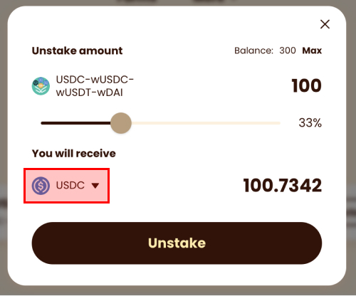

# BunnyDucky Staking

By depositing into BunnyDucky's vault, you will receive yield tokens that representsthe value of an auto-compounding strategy. Your yield tokens will allow you to withdraw your original deposited amount PLUS the profits that have accrued. Furthermore, the yield tokens can be used in other protocols, such as lending, as collateral.

## LP Staking

Choose from the list of available farms that you want to join:

Depositing LP tokens into the farm to mint yield tokens for that LP:

As profits are harvested, BunnyDucky will auto-compound the profits to more LP tokens. Your yield tokens will entitle you to withdraw more LP tokens as profits are accrued.

## Direct Staking

It is a hassle to have to create LP tokens manually. Instead, you can deposit USDC directly through BunnyDucky's UI.

For example, Mercurial's wUSD-4pool supports four assets:

- USDC (Wormhole Ethereum)
- USDC (Sollet)
- USDT (Wormhole Ethereum)
- DAI (Wormhole Ethereum)

You can choose to deposit any one of these from the dropdown menu:

In one transaction, 10 USDC will be deposited into Mercurial to form LP, and the LP will be deposited into BunnyDucky to form an auto-compoundinig yield token.

> Note: The step going from USDC to LP may have exchange rate fluctuations. If
> you deposit \$100 into an LP pool, it's possible that a different amount comes
> out upon withdrawal. Over the long-term profits accrue and you end up with
> more.

## Withdrawal

BunnyDucky aims to invest close 100% of the deposited value to maximize capital efficiency. When you withdraw, it may trigger the protocol to divest from the underlying strategy.

Depending on which strategy the protocol needs to divest from, a "pending withdrawal" record is created on-chain, and it may take 2~3 minutes for it to complete:

Once the protocol completes the withdrawal, the LP tokens would arrive in your wallet. Click on "unstake" if you want to exit the LP:

From the dropdown menu, you can choose which asset you want to exit the LP into:

## Mint PAI

You can use your yToken as collateral to borrow Parrot's stablecoin PAI. Visit [parrot.fi/vaults](parrot.fi/vaults), and select any of the supported yToken vaults. Currently there are two:

- Yield MER LP wUSD4Pool
- Yield SBR LP USDT-USDC

Click on "mint":

Then input the amount of yToken you want to deposit, and the amount of PAI you want to borrow:

Once you've minted PAI, you can go to [PNG.fi](https://app.png.fi/swap) to trade PAI for different assets.

To repay PAI, see the [PAI Repayment guide](https://doc.parrot.fi/guide/pai.html#repay-pai).
